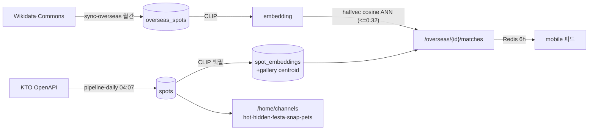
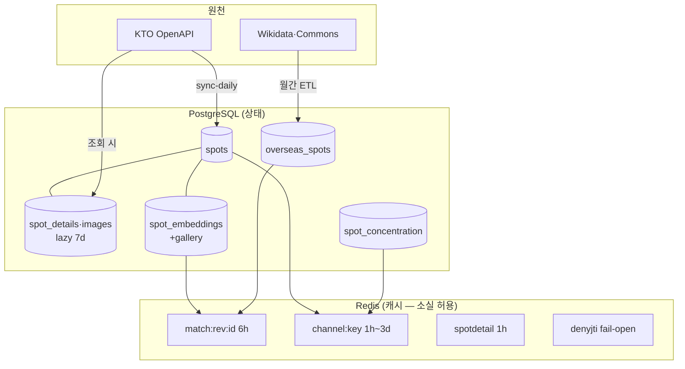

# 아키텍처

> 이 시스템이 어떻게 생겼는지 — 유닛 경계 · 모듈 규칙 · 데이터 흐름 · 캐시 ·
> 자동화. 호출 계약은 [api](api.md), 결정 배경은 [decisions](decisions.md),
> 스키마 정본은 Alembic 히스토리다.

## 유닛과 모듈

### 맥락

PicTrip은 KTO TourAPI의 국내 관광지(`spots` ~68k)와 Wikidata/Commons의 해외
게시물(`overseas_spots` 2,347행) 위에 CLIP 이미지 임베딩 매칭을 얹은 추천
서비스다(LLM 미사용). 배포 단위는 5개 + Worker — backend(FastAPI, CT112) ·
mobile(Expo) · web(CF Pages) · pipeline(ETL CLI, CT111) · deploy(IaC) ·
`workers/img-proxy`(이미지 프록시). 인프라는 Proxmox 홈서버 + Cloudflare, AWS 없음.

두 가지가 시스템의 축이다. **임베딩 저장소**(`spot_embeddings`(+gallery)·
`overseas_spots.embedding`, 전부 `halfvec(512)` HNSW)가 매칭의 기반이고,
**모듈 경계**(import-linter·ESLint가 CI 강제)가 코드의 형태를 지킨다.

### 핵심 개념

- **백엔드 모듈 7개** — `app/modules/{users,spots,feed,images,map,admin,agent}`,
  모듈마다 `routes → services → repositories → models/schemas` 층. routes는
  HTTP I/O만(DB·비즈니스 로직 금지), 교차 모듈 읽기는 상대 `services.py` 경유.
  admin만 예외: read-only 집계 + `overseas_spots.is_hidden` 한정 쓰기.
- **공유 패키지 레이어링** — `modules` > `security|kto|kakao|naver|ml` > `web` >
  `core` (import-linter 강제). `core`=인프라 배관(db·redis·logging·version),
  `web`=HTTP 계약(envelope·errors·middleware·ratelimit), `security`=jwt,
  `kto`·`kakao`·`naver`=외부 제공자 어댑터, `ml`=CLIP embedding. 공유 패키지 입장
  자격은 **2+ 모듈 소비** — 단일 소비자 코드는 모듈 안에 둔다.
- **spots 는 services 패키지가 유일한 공개 seam** — 다른 모듈이 `spots.services.
  rows`·`.saved` 같은 서브모듈을 직접 import 하는 것은 계약으로 막혀 있다.
- **JSend + AppError** — 모든 응답은 `{data, error, meta}`(`ok()`/`err()`),
  에러는 `AppError` 서브클래스가 HTTP 상태를 결정. 모바일은 `err.code`로만
  분기하며 코드 union은 `mobile/src/lib/app-error.ts`와 동기다.
- **backend/pipeline 분리** — 별도 Python 프로젝트(공유 venv 없음). 유일한 결합은
  CT110의 `spots` + `sync_runs` 테이블. `sync_runs`는 pipeline 소유
  (`CREATE TABLE IF NOT EXISTS`) — backend Alembic에 절대 추가하지 않는다.
- **모바일 레이어** — `src/app`(얇은 라우트) / `src/features/<domain>` /
  `src/lib·components·constants`. ESLint `no-restricted-imports`가 공유 레이어의
  피처 의존을 차단한다.

용어는 [glossary](architecture.md), 테이블·캐시는 [data-model](architecture.md) 참조.

### 어떻게 맞물리나



### 매칭 경로

`GET /explore`가 해외 게시물을 seed+커서로 내려주고, 사용자가 스와이프하면
`GET /overseas/{id}/matches`가 ANN 검색으로 국내 3곳을 반환한다. 후보는
attraction 버킷으로 게이트하고, 대표사진 편향은 갤러리(최대 5장) centroid
임베딩으로 완화한다. 결과는 `match:{revision}:{id}`에 6h 캐시하고
`matching:revision` incr로 전체 무효화한다.

### 이미지 경로

원본 URL(KTO `tong.visitkorea.or.kr`, Commons)은 `img.pictrip.org` Worker가
프록시·엣지 캐시한다. 서버측 변형(`/t1/{width}/{sig}/…` HMAC 리사이즈)은
공공누리 `Type1`에만 발급하고 `Type3`는 무변형 pass-through다(→
[ADR-0005](decisions.md)). 발급 SSOT는
`feed/services/display.py`.

### 설계 근거 / 트레이드오프

- **모놀리스 + 모듈 경계** — 서비스 분리 대신 import-linter 계약 8개로 경계를
  산다. 1인 운영 규모에서 배포·관측 비용이 낮고, 경계 위반은 CI가 잡는다.
- **캐시는 Redis, 상태는 PG** — 매칭·채널·상세는 전부 재계산 가능한 캐시라
  Redis 소실이 데이터 손실이 아니다. 인증도 같은 원칙(fail-open, →
  [decisions](decisions.md)).
- **KTO lazy fetch** — 상세(`spot_details`)·이미지는 조회 시점에 KTO를 호출해
  7일 캐시한다. 전량 선수집은 쿼터(~1k/일)가 허용하지 않는다. 대가는 콜드
  첫 조회 지연이고, 채널 워밍·엣지 캐시가 이를 줄인다.
- **HNSW 파라미터는 마이그레이션과 일치 필수** — 모델의 m/ef_construction이
  베이스라인 마이그레이션과 어긋나면 autogenerate가 드리프트를 낸다.
  `hnsw.ef_search=80`은 `app/core/db.py`의 asyncpg `server_settings`.

## 데이터 모델

### 맥락

데이터는 세 겹이다. **PG(CT110)가 상태**, **Redis(CT112)가 재계산 가능한
캐시**, **KTO/Commons 원격이 원천**. Redis를 통째로 잃어도 데이터 손실이
아니라 콜드 스타트일 뿐이다 — 인증까지 같은 원칙을 따른다(→
[decisions](decisions.md)).

### 핵심 개념

- **스키마 소유 vs 데이터 적재** — 스키마는 전부 backend Alembic이 소유한다.
  예외는 `sync_runs` 하나(pipeline 소유, backend는 raw SQL read-only).
  데이터 적재 주체는 테이블마다 다르다: `spots`=pipeline 일일 sync,
  `spot_details`/`spot_images`=backend lazy fetch(7일 캐시),
  `overseas_spots`=pipeline 월간 ETL, 임베딩=backend 잡.
- **lazy fetch가 기본** — KTO 상세·이미지는 조회 시점 수집이다. `overview`는
  `spot_details`에 있고(`spots` 아님) **verbatim 저장·표시**한다.
- **임베딩 3자리** — 대표사진(`spot_embeddings`) + 갤러리 centroid
  (`spot_embeddings_gallery`, 최대 5장 평균 — 대표사진 복권 완화) + 해외
  (`overseas_spots.embedding`). 전부 `halfvec(512)` HNSW(halfvec_cosine).
  벡터 리터럴은 `... <=> $1::halfvec(512)`로 캐스팅한다. 이미지 URL이 바뀌면
  DB 트리거(0019·0020)가 임베딩 행을 삭제/큐잉해 재임베딩을 강제한다.
- **모델 없는 보존 테이블** — 서빙에서 은퇴했지만 아직 DROP 하지 않은 테이블은
  ORM 이 없으므로 autogenerate `include_object` 제외가 유일한 보호막이다
  (현재 `plans` · `travel_shorts` · `travel_shorts_spots`). `curations` ·
  `curation_spots` 는 리비전 `0026` 에서 실제로 DROP 했다.
- **의도적 unmapped 컬럼** — `user_consents.notification_consent`는 DB에
  있으나 ORM에 매핑하지 않는다(expand→contract 중간 상태).
- **반대 방향의 이상 항목** — `user_consents.photo_consent`는 ORM에 살아 있는
  `Mapped[bool]`(`users/models.py`)이지만 **읽기·쓰기 경로가 하나도 없다**.
  사진 분석 선택 동의를 화면·API·스키마에서 걷어내면서 컬럼과 매핑만 남겼다.
  DROP은 일부러 미뤘다(expand→contract, → [ADR-0002](decisions.md)) —
  매핑이 살아 있다고 사용 중으로 읽지 말 것.

### 어떻게 맞물리나



### 설계 근거 / 트레이드오프

- **halfvec** — full float 대비 저장 절반, 68k+ 규모에서 재현율 손실은
  실측상 무시 가능. HNSW 파라미터는 베이스라인 마이그레이션과 일치가 강제다.
- **centroid를 별도 테이블로** — 대표사진 임베딩을 덮지 않고 나란히 둬서
  매칭 전략을 쿼리에서 선택한다. 대가는 조인 한 번.
- **트리거 기반 임베딩 무효화** — 앱 코드가 아니라 DB가 "이미지 변경 =
  임베딩 무효"를 보증한다. image-validate가 URL을 재작성하면 자동으로
  재임베딩 큐에 쌓인다(→ [operate-embeddings](architecture.md)).

## 테이블·Redis 키 레퍼런스

### 테이블 (PostgreSQL + pgvector, CT110)

스키마 소유는 전부 backend Alembic(예외: `sync_runs`). "적재" = 데이터를 쓰는 주체.

| 테이블 | 적재 | 요지 |
|---|---|---|
| `spots` | pipeline (일일) | KTO 마스터. `show_flag=1` 부분 인덱스 다수 · `cpyrht_div_cd` CHECK(Type1/Type3) · `idx_spots_image_pool` |
| `spot_details` | backend (lazy) | detail* 90일 캐시 — 실무 무효화는 `spots.modified_time` 비교. **`overview`는 여기, verbatim** |
| `spot_images` | backend (lazy) + `pipeline-weekly` gallery-repair | detailImage2 URL·`cpyrht_div_cd`만 (bytes 금지) · (content_id, sort_order) unique. 갤러리 잡이 임베딩용으로 부르는 detailImage2 응답을 같은 콜로 함께 적재 |
| `spot_embeddings` | backend 잡 | 대표사진 CLIP `halfvec(512)` · HNSW(halfvec_cosine, m/ef=0005와 일치 필수) |
| `spot_embeddings_gallery` | backend 잡 | 갤러리 ≤5장 centroid · 0020 트리거가 이미지 변경 시 행 삭제 |
| `embedding_failures` | backend 잡 | 재시도 큐 (`reason`, `--only-failed` 대상) |
| `overseas_spots` | pipeline (월간) | 해외 게시물. `wikidata_id` unique · `fame_score` · `is_hidden`(admin 토글) · embedding HNSW · 0019 트리거 |
| `spot_concentration` | 일일 크론 | 집중률 0–100 — Hot/Hidden 채널 · agent 혼잡도 축 소스. 커버리지는 전량이 아니다(2026-07-26 실측: attraction 모수 11,575곳 중 5,323곳 = **46.0%**) |
| `users` | backend | `taste_vector halfvec(512)` · email 부분 unique(`deleted_at IS NULL`) · `password_hash` 는 구 이메일 로그인 잔재로 쓰기 경로가 없다(탈퇴 시 NULL로 지움) |
| `user_auth_providers` | backend | provider CHECK(kakao/google/apple/email) — 서빙은 kakao·apple만, google/email 행은 잔존 · (provider, provider_user_id) unique · `provider_refresh_token` 은 애플 전용(탈퇴 시 `/auth/revoke` 호출용) |
| `user_consents` | backend | `notification_consent` 컬럼은 의도적 unmapped. `photo_consent` 는 그 반대 — ORM에 매핑돼 있으나 읽기·쓰기 경로가 없다(DROP 보류) |
| `user_saved_spots` | backend | (user_id, content_id) PK · 양방향 CASCADE |
| `admin_users` | 수동 | 콘솔 자격증명 (bcrypt) |
| `moods` · `spot_moods` | 시드/pipeline | **서빙 표면 있음** — agent `mood_search` 축(`EXISTS` 서브쿼리). 4,677행 전부 `source='code'`·`confidence=1.00`(카테고리에서 결정적 파생). 코드 8종 중 **7종만 쓴다** — `market`은 카테고리 술어에서 SH06이 빠져 모수 0 |
| `regions` · `sigungus` · `lcls_systm_codes` | 시드/pipeline | 마스터 코드 |
| `sync_runs` | **pipeline 소유** | backend는 raw SQL read-only. **backend Alembic 추가 금지** |
| `plans` · `travel_shorts` · `travel_shorts_spots` | — | 은퇴 자산. ORM 없음 — autogenerate `include_object` 제외로 보존. DROP 은 별도 리비전 |

- 벡터 리터럴: `... <=> $1::halfvec(512)`.
- `hnsw.ef_search=80` — `app/core/db.py` asyncpg `server_settings`.

### Redis 키 (CT112)

AOF everysec + RDB · `noeviction` 256mb. 전부 재계산 가능한 캐시.

| 패턴 | TTL | 용도 |
|---|---|---|
| `denyjti:{jti}` | refresh 잔여 수명 | 로그아웃/탈퇴 denylist (**fail-open**) |
| `rl:{bucket}:{ip}` | 60s | rate-limit 카운터 (fail-open) |
| `spotdetail:v2:{contentId}` | 1h | 상세 응답 hot front. 갤러리 백필이 `spot_images`를 바꾸면 해당 키를 지운다 |
| `spotdetail:refresh:v1:{contentId}` | 20s | 상세 백그라운드 갱신 중복 방지 락 (SET NX, 소유 토큰 compare-and-delete) |
| `spotdetail:refresh-backoff:v1:{contentId}` | 60s | KTO 상세 갱신 실패 재시도 제한 |
| `match:{revision}:{overseasId}` | 6h | 매칭 결과 — `matching:revision` incr로 전체 무효화 |
| `channel:{key}:{version}` | KTO 채널 3d / 집중률 1h | 홈 채널 카드 |
| `festival:pool:v2` | 48h (신선도는 날짜 기준) | agent 축제 축 풀 (`searchFestival2` 최근 1년 시작분 중 오늘 진행분 전량, ≤6,000) |
| `region:{lat:.3f}:{lng:.3f}` | 1d | Kakao 역지오코딩 (null 캐시 포함) |
| `admin:embed:running` | 4h | 재임베딩 잡 분산 락 (SET NX) |

## 마이그레이션 (Alembic)

backend 가 **`sync_runs` 를 뺀 모든 테이블**을 소유한다. `sync_runs` 는 pipeline
이 `CREATE TABLE IF NOT EXISTS` 로 만들며, `env.py` 의 `include_object` 가
autogenerate 에서 제외해 DROP 제안을 막는다.

- autogenerate 는 **부분 인덱스**(`WHERE show_flag = 1`)와 **명명 CHECK 제약**을
  놓친다. 생성된 SQL 을 직접 읽고 손으로 채운다.
- forward-only · expand→contract — 파괴적 변경은 무참조를 확인한 뒤 별도 리비전으로.
- 실행은 `POSTGRES_DB=pictrip_test` 로.
- `include_object` 예외 목록에는 은퇴했지만 아직 DROP 하지 않은 테이블도 들어간다
  (`plans` · `travel_shorts` · `travel_shorts_spots`). ORM 이 없으므로 이 목록이
  유일한 보호막이다.

## 자동화 · 배포

### 토폴로지

```
Proxmox (pve, Tailscale 100.83.101.1)
├── CT110  PostgreSQL+pgvector          ← CT112만 라우트 보유
├── CT111  pipeline · 러너 [ct111] · Uptime-Kuma(:3001, tailnet 전용)
├── CT112  api+Redis(compose) · cloudflared(호스트 프로세스) · 러너 [ct112]
└── CT113  (미생성 — Prometheus·Grafana 는 Phase 3)
Cloudflare: api.pictrip.org(터널) · pictrip.org(Pages, root=web/, main) · img.pictrip.org(Worker)
```

배포 레일: **dev 머지 = 라이브**(backend→CT112 · pipeline→CT111 · mobile→OTA),
main = 릴리스 마커(web·CodeQL), `v*` 태그 = TestFlight(→
[deploy-and-release](architecture.md)).

### 수집 DAG (KST)

`schedule`은 **default 브랜치(dev) 기준**으로만 돈다. 수집 잡은 시각 크론으로
흩어놓지 않고 주기별 DAG 3개에 `needs:` 로 묶는다 — 워밍은 원인 잡 뒤에, 재임베딩은
데이터가 바뀐 잡 뒤에 붙어야 의미가 있다.

정각(`0 * * * *`)을 피해 `:07`·`:13`·`:23` 에 건다. 스케줄 디스패치는 GitHub 이
큐잉하고 정각은 전 세계 크론이 몰려 지연된다 — self-hosted 러너라도 트리거는 큐를 탄다.

| 잡 | 시각 | DAG |
|---|---|---|
| `pipeline-daily.yml` | 매일 04:07 | `sync-kto` → {`concentration`, `detail-prewarm`, `embed`} → `warm` → `heartbeat` |
| `pipeline-weekly.yml` | 일요일 04:23 | `sync-full` → {`image-validate` → {`embed-repair`, `gallery-repair`}, `signals`} → `heartbeat` |
| `pipeline-monthly.yml` | 매월 2일 03:13 | `overseas-etl` → {`embed`, `warm`} → `heartbeat` |

- **`embed`가 `sync-kto`에 연쇄하는 것이 핵심.** 신규 스팟은 `UPDATE OF
  first_image_url` 트리거에 안 걸려 `embedding_failures` 에도 안 쌓인다 — 이 링크가
  없으면 새 KTO 스팟이 이미지 검색·매칭에서 영영 누락된다.
- **증분은 워터마크 날짜부터 오늘까지 하루씩 훑는다.** KTO `modifiedtime` 은 하한이
  아니라 그 날짜만 고르는 필터라, 하루치만 요청하면 워터마크가 그 날에 갇힌다
  (2026-06-26 부터 54일간 실제로 그랬다 — `fetched=10 · skipped=10` 이 매일 success 로 기록).
- **`sync-full`이 유일한 soft-delete 경로.** 일일 증분은 `modifiedtime` 필터라
  "사라진 스팟"을 못 본다. 응답이 현재 노출분의 절반 미만이면 `PartialFullSync` 로
  중단한다(부분 응답이 전체를 숨기는 사고 방지).
- 임베딩 잡 3종은 `admin:embed:running` Redis 락을 공유하므로 job-level
  `concurrency: embedding-job` 으로 워크플로를 가로질러 직렬화한다.
- `heartbeat` 는 **CT111** Uptime-Kuma push 모니터를 때린다(→ [monitoring](../../deploy/monitoring/README.md)). 잡 실패뿐 아니라 **"아예
  안 돌았음"**(GitHub 장애·60일 무활동 시 스케줄 자동 비활성)까지 Kuma 타임아웃으로
  잡힌다. 푸시 URL 시크릿이 없으면 조용히 건너뛴다.

### 그 밖의 타이머 (CT112 systemd)

| 시각 | 잡 | 목적 |
|---|---|---|
| 매일 04:00 | `warm-channels.timer` | 채널 캐시 예열 (배포 직후에도 `deploy.sh`가 호출) |
| 월 05:00 | `docker-prune.timer` | 디스크 풀 배포 실패 재발 방지 |
| 월 12:00 / 13:00 | `codeql` / `weekly-deep-check` | main 스윕 / 의존성 감사(advisory) |

> CT111 의 `pictrip-sync-v2.timer` 는 **은퇴** — 일일 수집은 `pipeline-daily.yml`
> 이 쥔다. 이관 시 CT111 에서 `systemctl disable --now pictrip-sync-v2.timer`.

### 워크플로

| 파일 | 트리거 | 요지 | 러너 |
|---|---|---|---|
| `pipeline-daily` / `-weekly` / `-monthly` | schedule + dispatch | 수집 DAG (위 표) | ct111+ct112 |
| `img-cache-warm` | `workflow_call` + dispatch | 엣지 워밍 — **ct111 러너 필수**(CF 캐시는 콜로 단위, 국내망이어야 KR 콜로가 데워짐). 자체 스케줄 없음 | ct111 |
| `backend-ci` / `mobile-ci` / `pipeline-ci` / `web-ci` | PR (경로) | 유닛별 게이트. web-ci=`.well-known` JSON 유효성(무효 JSON은 딥링크를 조용히 깨뜨림) | ubuntu |
| `pr-check` | PR 본문 | 템플릿 섹션·체크박스 (required) | ubuntu |
| `backend-deploy` | push dev | test → GHCR → CT112 `deploy.sh` | ubuntu+ct112 |
| `pipeline-deploy` | push dev | rsync(`.env`·`.venv` 보존) — 다음 DAG 실행이 새 코드를 쓴다 | ct111 |
| `mobile-ota` | push dev | EAS Update — `EXPO_PUBLIC_*` 주입 스텝 필수(빠지면 로그인 전멸 OTA) | ubuntu |
| `mobile-deploy` | tag `v*` | EAS iOS 빌드 + TestFlight 제출 | ubuntu |
| `backend-backfill-embeddings` / `-nicknames` | manual | 라이브 컨테이너 exec 백필 (기본 dry-run) | ct112 |
| `backend-logs` / `backend-oidc-logs` | manual | 원격 로그 grep / OIDC 거부 사유 | ct112 |
| `agent-detail-coverage` | manual | `spot_details` 커버리지 실측 (읽기 전용, KTO 콜 0) | ct112 |

### 공통 액션

| 액션 | 용도 |
|---|---|
| `.github/actions/api-exec` | `:8000` 서빙 중인 라이브 api 컨테이너에서 `python -m <module>` 실행 (CT110 경로·`.env`·CLIP 이미지를 가진 유일한 곳) |
| `.github/actions/heartbeat` | Uptime-Kuma push 보고. URL 시크릿 없으면 no-op |

### 시크릿 위치 (값 커밋 금지)

| 위치 | 내용 |
|---|---|
| CT112 `/opt/pictrip-api/.env` (:ro 마운트) | 백엔드 전체 — 수정 후 `docker restart` |
| CT111 `.../pipeline/.env` | `DATABASE_URL` · `KTO_API_KEY` |
| GitHub Actions | `EXPO_TOKEN`; `KUMA_PUSH_PIPELINE_{DAILY,WEEKLY}`(미주입 시 heartbeat no-op) |
| Wrangler | `T1_SECRET` (백엔드 .env와 미러) |
| EAS `eas.json` | `EXPO_PUBLIC_*` (Kakao·Google 키) |

admin 콘솔 인증은 env가 아니라 `admin_users` 테이블(→
[inspect-prod](architecture.md)).

## 용어

| 용어 | 정의 |
|---|---|
| **스팟** (`spot`, `contentId`) | KTO 국내 관광지 1건. `contentId`(문자열)가 canonical 키. |
| **해외 게시물** (`overseas_spot`) | Wikidata 유래 해외 명소 1건 — 피드의 hero. `wikidata_id` unique, `fame_score`로 정렬, `is_hidden`으로 모더레이션. |
| **매칭** (`match`) | 해외 게시물 임베딩과 국내 임베딩의 코사인 거리 ANN 상위 3곳. `MATCH_DISTANCE_MAX=0.32` 이내만. |
| **채널** (`channel`) | 홈 상단 타일 6종 — `around`(내 주변)·`hot`·`hidden`(집중률 기반)·`festa`·`pets`·`snap`(KTO 서비스 기반). |
| **집중률** (`spot_concentration`) | KTO TatsCnctrRateService의 상대 방문 집중도(0–100). Hot/Hidden 채널의 소스. |
| **갤러리 centroid** | 스팟 갤러리 최대 5장의 CLIP 임베딩 평균 — 대표사진 한 장의 편향(복권)을 완화. |
| **halfvec** | pgvector의 half-precision 벡터 타입. 임베딩 컬럼 전부 `halfvec(512)`. |
| **JSend 엔벨로프** | 모든 API 응답 형태 `{data, error, meta}`. `meta.traceId` 자동 주입. |
| **AppError 코드** | 에러 분기 계약. 모바일은 `err.code`로만 분기(`err.message` 금지). union은 `app-error.ts`와 동기. |
| **공공누리 Type1/Type3** (`cpyrhtDivCd`) | KTO 이미지 라이선스 구분. Type1=출처표시(변형 가능), Type3=변경금지(무변형 pass-through만). |
| **t1 변환** | `img.pictrip.org/t1/{width}/{sig}/…` — Type1 한정 HMAC 서명 서버측 리사이즈(폭 1620). |
| **워터마크 클리핑** | KTO 이미지 하단 ~12% 밴드를 프레임 밖으로 미는 클라이언트 CSS 프레이밍. 파일 무변형 — Type 구분과 무관. |
| **blur-up** | 미드사이즈를 블러 프리뷰로 먼저 그리고 본 이미지를 페이드인하는 로딩 패턴. |
| **seed** | 피드/탐색 셔플 키. 당겨서 새로고침 = 새 seed. |
| **denylist** (`denyjti:{jti}`) | 로그아웃·탈퇴된 refresh 토큰의 Redis 표식. fail-open(→ [decisions](decisions.md)). |
| **centroid (지역)** | 시군구 중심좌표 — 사전계산 없이 spots mapx/mapy 런타임 AVG. |
| **watermark (sync)** | pipeline 증분 동기화의 `modifiedtime` 기준점. TEXT 원문으로 저장. |
| **expand→contract** | 추가 마이그레이션 먼저, 파괴적 변경은 무참조 확인 후 별도 리비전(→ [ADR-0002](decisions.md)). |
| **runtimeVersion** | OTA 전달 범위를 정하는 키. `policy: appVersion` 이므로 `app.json` 의 `version`(현재 `1.0.0`) 이 같은 빌드끼리 OTA를 주고받는다. 네이티브를 바꾸면 `version` 을 올려 구 빌드를 갈라놓아야 한다. |
| **바운스 (OAuth)** | 카카오가 커스텀 스킴을 거부해 `pictrip.org/oauthredirect`가 `pictrip://`로 재전송하는 우회. |
