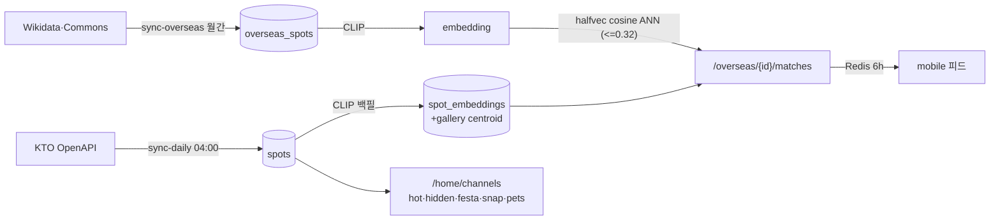

# 아키텍처 개요

> 이 문서는 PicTrip의 유닛 경계와 해외 게시물 → 국내 매칭 데이터 흐름을 설명한다.

## 맥락

PicTrip은 KTO TourAPI의 국내 관광지(`spots` ~68k)와 Wikidata/Commons의 해외
게시물(`overseas_spots` 2,347행) 위에 CLIP 이미지 임베딩 매칭을 얹은 추천
서비스다(LLM 미사용). 배포 단위는 5개 + Worker — backend(FastAPI, CT112) ·
mobile(Expo) · web(CF Pages) · pipeline(ETL CLI, CT111) · deploy(IaC) ·
`workers/img-proxy`(이미지 프록시). 인프라는 Proxmox 홈서버 + Cloudflare, AWS 없음.

두 가지가 시스템의 축이다. **임베딩 저장소**(`spot_embeddings`(+gallery)·
`overseas_spots.embedding`, 전부 `halfvec(512)` HNSW)가 매칭의 기반이고,
**모듈 경계**(import-linter·ESLint가 CI 강제)가 코드의 형태를 지킨다.

## 핵심 개념

- **백엔드 모듈 7개** — `app/modules/{users,spots,feed,images,map,system,admin}`,
  모듈마다 `routes → services → repositories → models/schemas` 층. routes는
  HTTP I/O만(DB·비즈니스 로직 금지), 교차 모듈 읽기는 상대 `services.py` 경유.
  admin만 예외: read-only 집계 + `overseas_spots.is_hidden` 한정 쓰기.
- **공유 패키지 레이어링** — `modules` > `security|kto|ml` > `web` > `core`
  (import-linter 강제). `core`=인프라 배관(db·redis·logging·version),
  `web`=HTTP 계약(envelope·errors·middleware·ratelimit), `security`=jwt·passwords,
  `kto`=KTO 클라이언트+이미지 URL 헬퍼, `ml`=CLIP embedding. 공유 패키지 입장
  자격은 **2+ 모듈 소비** — 단일 소비자 코드는 모듈 안에 둔다.
- **JSend + AppError** — 모든 응답은 `{data, error, meta}`(`ok()`/`err()`),
  에러는 `AppError` 서브클래스가 HTTP 상태를 결정. 모바일은 `err.code`로만
  분기하며 코드 union은 `mobile/src/lib/app-error.ts`와 동기다.
- **backend/pipeline 분리** — 별도 Python 프로젝트(공유 venv 없음). 유일한 결합은
  CT110의 `spots` + `sync_runs` 테이블. `sync_runs`는 pipeline 소유
  (`CREATE TABLE IF NOT EXISTS`) — backend Alembic에 절대 추가하지 않는다.
- **모바일 레이어** — `src/app`(얇은 라우트) / `src/features/<domain>` /
  `src/lib·components·constants`. ESLint `no-restricted-imports`가 공유 레이어의
  피처 의존을 차단한다.

용어는 [glossary](glossary.md), 테이블·캐시는 [data-model](data-model.md) 참조.

## 어떻게 맞물리나

### 매칭 경로

`GET /feed`가 해외 게시물을 seed+커서로 내려주고, 사용자가 스와이프하면
`GET /overseas/{id}/matches`가 ANN 검색으로 국내 3곳을 반환한다. 후보는
attraction 버킷으로 게이트하고, 대표사진 편향은 갤러리(최대 5장) centroid
임베딩으로 완화한다. 결과는 `match:{revision}:{id}`에 6h 캐시하고
`matching:revision` incr로 전체 무효화한다.

### 이미지 경로

원본 URL(KTO `tong.visitkorea.or.kr`, Commons)은 `img.pictrip.org` Worker가
프록시·엣지 캐시한다. 서버측 변형(`/t1/{width}/{sig}/…` HMAC 리사이즈)은
공공누리 `Type1`에만 발급하고 `Type3`는 무변형 pass-through다(→
[ADR-0005](../adr/0005-kto-image-policy.md)). 발급 SSOT는
`feed/services/display.py`.

## 설계 근거 / 트레이드오프

- **모놀리스 + 모듈 경계** — 서비스 분리 대신 import-linter 계약 6개로 경계를
  산다. 1인 운영 규모에서 배포·관측 비용이 낮고, 경계 위반은 CI가 잡는다.
- **캐시는 Redis, 상태는 PG** — 매칭·채널·상세는 전부 재계산 가능한 캐시라
  Redis 소실이 데이터 손실이 아니다. 인증도 같은 원칙(fail-open, →
  [ADR-0001](../adr/0001-denylist-only-auth.md)).
- **KTO lazy fetch** — 상세(`spot_details`)·이미지는 조회 시점에 KTO를 호출해
  7일 캐시한다. 전량 선수집은 쿼터(~1k/일)가 허용하지 않는다. 대가는 콜드
  첫 조회 지연이고, 채널 워밍·엣지 캐시가 이를 줄인다.
- **HNSW 파라미터는 마이그레이션과 일치 필수** — 모델의 m/ef_construction이
  베이스라인 마이그레이션과 어긋나면 autogenerate가 드리프트를 낸다.
  `hnsw.ef_search=80`은 `app/core/db.py`의 asyncpg `server_settings`.

---
관련: [product](product.md) · [data-model](data-model.md) · [glossary](glossary.md) · [api](../reference/api.md) · [database-schema](../reference/database-schema.md) · [adr/](../adr/)
