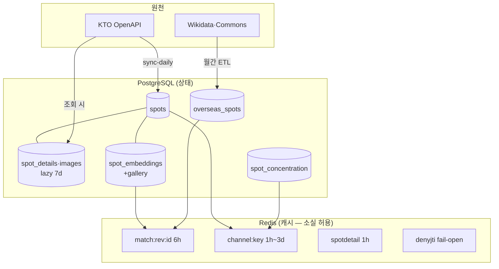

# 데이터 모델

> 이 문서는 테이블 소유권·임베딩 저장·캐시 계층의 개념을 설명한다. 전체 컬럼
> 표는 [database-schema](../reference/database-schema.md).

## 맥락

데이터는 세 겹이다. **PG(CT110)가 상태**, **Redis(CT112)가 재계산 가능한
캐시**, **KTO/Commons 원격이 원천**. Redis를 통째로 잃어도 데이터 손실이
아니라 콜드 스타트일 뿐이다 — 인증까지 같은 원칙을 따른다(→
[ADR-0001](../adr/0001-denylist-only-auth.md)).

## 핵심 개념

- **스키마 소유 vs 데이터 적재** — 스키마는 전부 backend Alembic이 소유한다.
  예외는 `sync_runs` 하나(pipeline 소유, backend는 raw SQL read-only).
  데이터 적재 주체는 테이블마다 다르다: `spots`=pipeline 일일 sync,
  `spot_details`/`spot_images`=backend lazy fetch(7일 캐시),
  `overseas_spots`=pipeline 월간 ETL, 임베딩=backend 잡.
- **lazy fetch가 기본** — KTO 상세·이미지는 조회 시점 수집이다. `overview`는
  `spot_details`에 있고(`spots` 아님) **verbatim 저장·표시**한다.
- **임베딩 3자리** — 대표사진(`spot_embeddings`) + 갤러리 centroid
  (`spot_embeddings_gallery`, 최대 5장 평균 — 대표사진 복권 완화) + 해외
  (`overseas_spots.embedding`). 전부 `halfvec(512)` HNSW(halfvec_cosine).
  벡터 리터럴은 `... <=> $1::halfvec(512)`로 캐스팅한다. 이미지 URL이 바뀌면
  DB 트리거(0019·0020)가 임베딩 행을 삭제/큐잉해 재임베딩을 강제한다.
- **모델 없는 보존 테이블** — `curations`/`curation_spots`는 서빙 은퇴 후
  테이블만 보존한다. ORM이 없으므로 autogenerate `include_object` 제외가
  DROP을 막는다(→ [ADR-0002](../adr/0002-expand-contract-migrations.md)).
- **의도적 unmapped 컬럼** — `user_consents.notification_consent`는 DB에
  있으나 ORM에 매핑하지 않는다(expand→contract 중간 상태).

## 어떻게 맞물리나

## 설계 근거 / 트레이드오프

- **halfvec** — full float 대비 저장 절반, 68k+ 규모에서 재현율 손실은
  실측상 무시 가능. HNSW 파라미터는 베이스라인 마이그레이션과 일치가 강제다.
- **centroid를 별도 테이블로** — 대표사진 임베딩을 덮지 않고 나란히 둬서
  매칭 전략을 쿼리에서 선택한다. 대가는 조인 한 번.
- **트리거 기반 임베딩 무효화** — 앱 코드가 아니라 DB가 "이미지 변경 =
  임베딩 무효"를 보증한다. image-validate가 URL을 재작성하면 자동으로
  재임베딩 큐에 쌓인다(→ [operate-embeddings](../how-to/operate-embeddings.md)).

---
관련: [architecture](architecture.md) · [database-schema](../reference/database-schema.md) · [operate-embeddings](../how-to/operate-embeddings.md) · [ADR-0002](../adr/0002-expand-contract-migrations.md)
