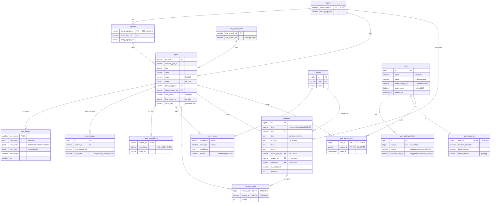

# S7 — DB 설계 (전 화면 data needs 종합 → 스키마 형식화)

> 세션 S7. 입력 SSOT: `session-context.md`(잠긴 결정·교차 reconcile 블록),
> `design-brief.md`, `CLAUDE.md`(Backend DB facts·Prohibitions),
> 화면 스펙 S1·S2·S3·S4·S5·S6의 data needs/reconcile 노트.
> **현 스키마(실제 코드 + Alembic 히스토리)가 진짜 SSOT**다 — 이 문서는 그 위에
> 화면들이 넘긴 data needs를 형식화한다. 설계 철학: 화면/API는 이상적으로, **DB는
> "이상 설계 → 현실 reconcile"**, 프로덕션 자산(spots ~68k + CLIP 임베딩 ~64%) 폐기 금지.
>
> 미해결/후속: 캐시·딥링크·호스팅 = **S8(인프라)**, 엔드포인트/직렬화 형식 = **S9(API)**,
> 마이그레이션 적용 순서·전체 reconcile = **S10**.

## 현 스키마 기준점 (Alembic head = `0010_drop_dead_tables`)

실제 코드 확인 결과 — 메모리/스펙 텍스트가 아니라 이게 권위:

- **0010에서 이미 드롭됨**(15개, schema-ahead-of-code): `user_sessions`·`user_devices`·
  `user_mood_preferences`·`taste_feedback_events`·`recommendation_logs`·`reason_cache`·
  `mood_prototypes`·`collections`·`collection_spots`·`region_visitors`·`sigungu_visitors`·
  `search_history`·`photo_search_sessions`·`kto_api_logs`·`kto_sync_runs`. → **재드롭 불필요.**
- **0005에서 이미 드롭됨**: `related_spots`·`tats_name_mappings`(TarRlteTar는 Redis-only).
- **0005에서 이동**: `spots.overview` → `spot_details.overview`(verbatim, 7일 캐시).
- **아직 살아있어 S7이 드롭 설계**: `courses`·`course_days`·`course_items`·`notifications`·
  `analytics_events`.
- **살아있으나 보존**: `spot_concentration` — ⚠️ 초기 S7은 "드롭"으로 적었으나 S9 §8.1·
  S10 §1.1이 이미 "보존(엔드포인트만 제거)"로 결정 → **S7 내부 모순을 보존으로 정정**(D1).
  데이터만 `congestion` 카드 enrichment로 재사용(§6.2), 트렌딩 엔드포인트/화면은 계속 제거.
- **죽은 컬럼**: `user_auth_providers.refresh_token_enc`(Redis jti 전용 결정과 모순) → 드롭.
- **이미 존재**: `users.profile_image_url varchar(500)` → S6 "avatar_url 추가"는 **기존 컬럼
  재사용**(신규 컬럼·마이그레이션 없음).

---

## 1. 엔티티 분류 (신규 vs 기존 vs 드롭)

| 구분 | 테이블/컬럼 | 비고 |
|---|---|---|
| **신규** | `curations` | 큐레이션 1급 엔티티(S2) |
| **신규** | `curation_spots` | 손픽·순서(S2) |
| **신규 인덱스** | `idx_spots_image_pool` | 랜덤 풀 has_kto_image 받침(S2) |
| **변경(드롭컬럼)** | `user_auth_providers.refresh_token_enc` | 죽은 컬럼 제거(S1) |
| **변경(드롭컬럼)** | `user_consents.notification_consent` | 알림 비목표(S6) |
| **재사용(무변경)** | `users.profile_image_url` | 아바타 URL = 기존 컬럼(S6) |
| **재사용(무변경)** | `spots`·`spot_details`·`spot_images`·`spot_moods`·`moods`·`regions`·`sigungus`·`lcls_systm_codes`·`spot_embeddings`·`user_saved_spots`·`user_auth_providers`·`user_consents`·`users` | 카드/상세/검색/저장 전부 기존 위에 얹음 |
| **보존(무변경)** | `spot_concentration` | ⚠️ **드롭→보존 정정**(D1·S10 §1.1). 트렌딩 엔드포인트/화면은 제거하되 데이터는 살림 — 카드 `congestion` enrichment 백킹(§6.2). 6,387행 생존, `scripts.sync_concentration` 적재. 스키마/인덱스 현행 유지 |
| **드롭(테이블)** | `courses`·`course_days`·`course_items`·`notifications`·`analytics_events` | 비목표 확정 |

---

## 2. ER 스케치 (신규 + 핵심 관계)

```
regions (ldong_regn_cd PK) ─┬─< sigungus (ldong_signgu_cd PK, ldong_regn_cd FK)
                            │        └─ (좌표 컬럼 없음 → centroid는 spots AVG 파생)
                            │
spots (content_id PK) ──────┼── ldong_regn_cd FK → regions
  │  ├ lcls_systm3 FK → lcls_systm_codes (lcls_systm3_cd PK; lcls_systm3_nm = 카드 세분 라벨)
  │  ├ first_image_url (카드 firstImageUrl, has_kto_image 조건)
  │  ├─1:1─ spot_details (overview verbatim, intro_data/info_data JSONB)
  │  ├─1:N─ spot_images (firstimage 외 갤러리, URL only)
  │  ├─1:1─ spot_embeddings (halfvec(512), HNSW; 사진검색/유사도)
  │  ├─M:N─ spot_moods ─ moods (mood 랜덤 풀)
  │  └─M:N─ user_saved_spots ─ users (스크랩)
  │
  ├──< curation_spots (curation_id, content_id) PK ── content_id FK → spots
  │
curations (id PK) ──┬── cover_spot_id  FK → spots         (SET NULL)
                    ├── region_cd      FK → regions       (type=region 풀 스코프)
                    └── mood_id        FK → moods         (type=mood 풀 스코프)

users (id PK) ──┬─1:N─ user_auth_providers (provider, provider_user_id) UNIQUE
                ├─1:1─ user_consents (user_id PK)
                └─< user_saved_spots
```

---

## 3. 신규 테이블 DDL (확정)

### 3.1 `curations`

| 컬럼 | 타입 | 제약 | 비고 |
|---|---|---|---|
| `id` | bigint | PK, identity | 코드베이스 PK 컨벤션. 딥링크는 `slug`가 담당(uuid 불필요) |
| `type` | varchar(16) | NOT NULL, CHECK | `region`·`mood`·`editorial`(editorial 미사용·슬롯 확장 대비) |
| `slug` | varchar(80) | NOT NULL, UNIQUE | 안정 식별·딥링크(S8) |
| `title` | text | NOT NULL | 줄바꿈(`\n`) **verbatim**, 클라 `pre-line` 렌더 |
| `subtitle` | text | NULL | 히어로 sub / 레일 subhead. **상세(06) 응답 생략**(목업 무) |
| `lead` | text | NULL | 상세 리드문(region만) |
| `intro` | text | NULL | 상세 본문(region만) |
| `cover_spot_id` | varchar(32) | FK→`spots.content_id` **ON DELETE SET NULL**, NULL | null이면 `curation_spots[0]` 폴백 |
| `region_cd` | varchar(8) | FK→`regions.ldong_regn_cd`, NULL | type=region 랜덤 풀 스코프 |
| `mood_id` | smallint | FK→`moods.id`, NULL | type=mood 랜덤 풀 스코프 |
| `is_published` | boolean | NOT NULL, default false | |
| `position` | integer | NOT NULL, default 0 | 홈 슬롯 정렬(type별) |
| `created_at` | timestamptz | NOT NULL, default now() | |
| `updated_at` | timestamptz | NOT NULL, default now(), onupdate now() | |

- CHECK: `ck_curation_type` → `type IN ('region','mood','editorial')`.
- CHECK: `ck_curation_scope` → `(type='region' AND region_cd IS NOT NULL) OR
  (type='mood' AND mood_id IS NOT NULL) OR type='editorial'` (D6·S11 §7-B).
- 인덱스: `idx_curations_feed (type, is_published, position)` — `/home/feed`가 type별
  published를 position 순으로 뽑는 핵심 경로. `slug` UNIQUE(딥링크/`/curations/{slug}`).
- ⚠️ **스코프 정합을 DB 보증으로 격상**(D6 정정): `region_cd`는 type=region일 때, `mood_id`는
  type=mood일 때 반드시 채움 — 기존 "부분 CHECK는 v1 미적용, 시드 스크립트 책임" 결정을
  `ck_curation_scope` 도입으로 뒤집어 **DB가 보증**(시드 실수로 풀 스코프 누락된 큐레이션이
  피드에 새는 것을 차단). 명명 CHECK이므로 M1 마이그레이션에 수동 추가(§9).

### 3.2 `curation_spots`

| 컬럼 | 타입 | 제약 | 비고 |
|---|---|---|---|
| `curation_id` | bigint | FK→`curations.id` **ON DELETE CASCADE**, PK | |
| `content_id` | varchar(32) | FK→`spots.content_id` **ON DELETE CASCADE**, PK | **카드 canonical=contentId → 컬럼명 `content_id` 통일**(스케치 `spot_id` 폐기) |
| `position` | integer | NOT NULL | 손픽 순서 |

- PK(`curation_id`, `content_id`) — 한 큐레이션에 같은 스팟 1회.
- 인덱스: `idx_curation_spots_order (curation_id, position)` — 손픽 그리드/레일 정렬 읽기.

### 3.3 랜덤 채움(테마-일치) 받침 인덱스 — 신규

손픽이 비면 서버가 **테마 일치 + 유효 KTO 이미지** 풀에서 결정적 seed로 ≤8 뽑음(S2 §2):

- ⚠️ **순수 `ORDER BY hash(content_id, curation_id)` 폐기**(D2·S11 §7-B) — 해시-only는 저품질
  스팟(overview/임베딩 결여)도 동률로 끌어올려 카드 품질이 들쭉날쭉. → **품질게이트 랭킹**으로 정정:
  - **필수 게이트**: `show_flag=1 AND first_image_url IS NOT NULL`(이미지 없는 카드 원천 차단).
  - **품질순 정렬**: `overview` 보유·임베딩 보유를 가산점으로 랭킹(품질 상위 버킷 형성).
  - **결정적 선택**: 상위 버킷(top~30)에서 `hash(curation_id, KST date)` seed로 8개 선택/회전 —
    결정성·일 캐시 유지(같은 날 같은 결과, 다음 날 회전).
- region 풀(품질게이트):
  `SELECT content_id FROM spots WHERE ldong_regn_cd=:rid AND show_flag=1 AND first_image_url IS NOT NULL
   ORDER BY (overview 보유) DESC, (임베딩 보유) DESC, ... LIMIT 30` → 상위 버킷에서 seed로 8개.
  - 기존 `idx_spots_active_region (ldong_regn_cd, ldong_signgu_cd) WHERE show_flag=1`는
    **이미지 보유 조건을 못 받침** → 신규 부분 인덱스:
    **`idx_spots_image_pool (ldong_regn_cd) WHERE show_flag = 1 AND first_image_url IS NOT NULL`**.
- mood 풀(품질게이트): `spots JOIN spot_moods ... WHERE mood_id=:mid AND show_flag=1 AND first_image_url IS NOT NULL`
  → 동일 품질순 정렬 후 상위 버킷에서 seed로 8개.
  - 기존 `idx_spot_moods_mood (mood_id, confidence DESC)` + 위 `idx_spots_image_pool`(image 필터)
    조합으로 충분 — mood 전용 신규 인덱스는 v1 불필요(받침 인덱스는 그대로 충분).
- `has_kto_image` 정의 = `first_image_url IS NOT NULL AND first_image_url <> ''`. KTO 컴플라이언스:
  URL만 참조(다운로드/저장 금지), `cpyrht_div_cd` Type3 정책은 동기화 단계에서 이미 보장.
- 결과의 일 캐시(Redis `curation:{id}:spots`)는 **S8** 확정. (품질게이트 랭킹은 결정적이라 캐시와 정합.)

---

## 4. 변경 (드롭 컬럼)

| 테이블 | 컬럼 | 액션 | 근거 |
|---|---|---|---|
| `user_auth_providers` | `refresh_token_enc text` | **drop column** | 잠긴 결정: 세션/디바이스 폐기, Redis jti 덴리스트만. 서버가 refresh 토큰 저장 안 함 → 죽은 컬럼(S1) |
| `user_consents` | `notification_consent boolean` | **drop column** | 알림 비목표(S6). 남기는 컬럼: `location_consent`·`photo_consent`·`terms_version`·`consented_at` |

- **동의 버전 추적** = 기존 `user_consents.terms_version varchar(16)` 그대로(예 `"v1.0"`).
  로그인 직후 스냅샷 upsert + 포그라운드 재동기화(S1). 별도 동의 이력 테이블 없음(lean).
- jti 덴리스트는 **Redis 모델**(테이블 아님) — DB 경계 밖. 키/TTL 형식은 S8.

---

## 5. 드롭 (테이블) — 비목표

| 테이블 | 액션 | 근거 |
|---|---|---|
| `course_items` → `course_days` → `courses` | **drop_table**(자식부터) | 코스 일체 비목표 |
| `notifications` | drop_table | 알림 비목표 |
| `analytics_events` | drop_table | analytics 비목표 |

- ⚠️ **`spot_concentration`은 이 표에서 제외**(드롭→**보존** 정정, D1·S10 §1.1). 초기 메모
  "2026-06-20 재결정: 보존→폐기"는 S9/S10과 모순이라 폐기 — 데이터는 살리고 `congestion`
  카드 enrichment로만 쓴다(§6.2). 엔드포인트/화면 제거는 그대로.
- 드롭되는 테이블은 모두 `user_id`/`content_id` FK 보유 → 자식→부모 순 drop. `analytics_events`·
  `notifications`는 독립(users FK만) → 단순 drop. `courses` 3종은 `course_items`→`course_days`→`courses`.

---

## 6. 카드 canonical 백킹 매핑 (교차결정 C1)

canonical 카드 `{ contentId, title, firstImageUrl, category }`(camelCase + KTO명)의 출처 —
백엔드가 이미 이 형으로 직렬화하므로 **신규 리네임 없음**:

| 필드 | DB 출처 | 비고 |
|---|---|---|
| `contentId` | `spots.content_id` | PK |
| `title` | `spots.title` | |
| `firstImageUrl` | `spots.first_image_url` | URL만(다운로드 X). null이면 카드 inset-gray |
| `category` | `lcls_systm_codes.lcls_systm3_nm` (조인: `spots.lcls_systm3 → lcls_systm_codes.lcls_systm3_cd`) | **세분 subtype 라벨**(B5/S3 §7) |

- 조인은 `lcls_systm3`(FK) → `lcls_systm_codes` PK 룩업 → O(1), 신규 인덱스 불필요.
- `lcls_systm3`이 null인 스팟 → `category` null 또는 coarse 폴백(직렬화 규칙 = S9).
- **칩 필터의 coarse 버킷(NearbyCategory 6종)은 별개** — `content_type_id`/`lcls_systm1`에서
  파생(매핑 규칙 = S9). 카드 표시 라벨(세분) ≠ 필터 버킷(coarse).
- ⚠️ **데이터-계약 갭(S9/S10)**: 현 `/map/nearby` 카드는 **coarse 버킷**을 `category`로 내림.
  S3/S5는 카드에 **세분 `lcls_systm3_nm`** 을 요구 → nearby 응답 DTO에 세분 라벨 추가 필요.
  **DB 변경 아님**(컬럼·조인 이미 존재) — 직렬화/엔드포인트 변경 = S9.

### 6.1 프로필/유저 매핑 (S6) — 신규 컬럼 없음

| API 필드(camelCase) | DB 출처 | 비고 |
|---|---|---|
| `id` | `users.id` | |
| `displayName` | `users.name` (varchar 50) | DB 컬럼명은 `name` — `display_name` 아님. 직렬화에서 rename |
| `email` | `users.email` | nullable, 활성 유저 unique 부분 인덱스 |
| `avatarUrl` | `users.profile_image_url` (varchar 500) | **기존 컬럼 재사용**. 폴백(모노그램/'여행자'/공급사 라벨)은 클라(S6) |
| 공급사 라벨 | `user_auth_providers.provider` | kakao/google/apple |
| 동의 상태 | `user_consents.location_consent`/`photo_consent`/`terms_version` | |

### 6.2 혼잡도(`congestion`) 카드 enrichment 백킹 (D1·S11 §7-A)

canonical 카드 선택 필드 `congestion: "low"|"medium"|"high"|null` — **신규 컬럼 없음**,
보존된 `spot_concentration`을 JOIN해 enrichment:

| 필드 | DB 출처 | 비고 |
|---|---|---|
| `congestion` | `spot_concentration` JOIN by `content_id`(오늘/현재 윈도우 값) | KTO 15128555(한국관광공사 집중률 예측, 향후 30일 상대집중률 0~100, 100=가장 붐빔). `scripts.sync_concentration` 적재 |

- **버킷팅**: 상대집중률 `v` → `v<34` → `low` / `34~66` → `medium` / `>66` → `high`,
  매칭 행 없으면 `null`(임베딩처럼 부분 커버리지 허용 — 없으면 카드에서 칩 생략).
- **필드 직렬화 = S9, 화면 표시 = S2/S3/S5.** DB 측은 보존 테이블 JOIN뿐(스키마/인덱스 무변경).
- 트렌딩 엔드포인트·화면은 계속 제거(D1) — `spot_concentration`은 **카드 enrichment 전용**으로만 생존.

---

## 7. 화면별 data needs → 엔티티 매핑 (요약)

| 화면(세션) | 필요 데이터 | 백킹 |
|---|---|---|
| 홈 피드(S2) | heroes6(커버) + rails3×≤8(카드) | `curations`(type별 published) + `curation_spots`/랜덤풀 + canonical 카드 |
| 큐레이션 상세(S2) | title/lead/intro/cover + 그리드8 | `curations`(region) + `curation_spots`/랜덤풀 |
| 스팟 상세(S3) | overview·메뉴·위치·갤러리·주변레일 | `spot_details`(overview verbatim, intro_data firstmenu/treatmenu, homepage/tel) + `spots`(mapx/mapy, addr) + `spot_images` + `/map/nearby` 카드(세분 라벨). `info_data`/`moods[]` **미사용** |
| 사진 검색(S4) | 유사 스팟 + distance | `spot_embeddings`(halfvec(512), `<=> $1::halfvec(512)`) + `spots.mapx/mapy`(거리). 업로드 바이트 메모리 폐기(KTO) |
| 지도(S5) | nearby(점+반경) + 지역트리 + centroid | `spots`(`idx_spots_active_location`) + `regions`/`sigungus`(트리) + **centroid=spots AVG 런타임 파생**. `crowd`→`congestion` 재도입(§6.2, S11 §7-A) |
| 저장·프로필(S6) | 스크랩 그리드 + 프로필 | `user_saved_spots`(canonical 카드) + `users`(name/email/`profile_image_url`) + `user_auth_providers`/`user_consents` |
| 인증(S1) | OIDC 매핑·동의 스냅샷 | `user_auth_providers`(provider+provider_user_id UNIQUE upsert) + `user_consents`(terms_version) |

---

## 8. centroid 파생 전략 (S5 위임 → 확정: 런타임 AVG)

`sigungus`에 좌표 컬럼 없음 → 시군구 중심 = **소속 스팗 좌표 평균을 요청 시 계산**.

- 쿼리: `SELECT AVG(mapx) cx, AVG(mapy) cy FROM spots WHERE ldong_signgu_cd=:sgg AND show_flag=1`.
- **빈 시군구/전부 NULL 폴백**: `AVG`는 행 0개·전부 NULL이면 **NULL 반환**(0 아님) — 결과가
  NULL이면 같은 식을 `ldong_regn_cd=:rgn`(시도)로 재계산 → 시도 centroid. 코드에서
  `cx/cy IS NULL` 체크로 폴백(또는 `COALESCE`). (검증: PG `avg`는 non-null만 평균.)
- **근사 평면 centroid**: `AVG(경도),AVG(위도)`는 구면 중심이 아닌 평면 평균 — 섬/이상치로
  약간 치우칠 수 있으나 "초기 재센터"용이라 허용(한국 중위도·날짜변경선 무관, 오차 무시).
- 받침: 기존 `idx_spots_active_region (ldong_regn_cd, ldong_signgu_cd) WHERE show_flag=1`.
  시군구당 수백 행 AVG → 비용 무시 가능. 저빈도 동작(사용자 `검색` CTA 탭 시에만).
- **신규 컬럼/스크립트 없음** — staleness·유지보수 부담 회피(YAGNI). 정말 느려지면 Redis
  캐시를 S8에서 얹음(스키마 변경 없이 가능). 사전계산 컬럼 방식은 채택 안 함.

---

## 9. 마이그레이션 방향 (Alembic revision 목록 — 적용 순서는 S10)

현 head `0010` 위에 쌓을 revision(논리 단위; 실제 분할은 S10):

1. **`xxxx_curations`** (= M1) — `create_table curations` + `curation_spots`.
   - `autogenerate가 놓치거나 부실` → **수동 추가/검토**: `ck_curation_type` CHECK,
     **`ck_curation_scope` CHECK**(D6 — `(type='region' AND region_cd IS NOT NULL) OR
     (type='mood' AND mood_id IS NOT NULL) OR type='editorial'`; autogenerate가 익명 CHECK를
     추적 못 하므로 **명명 CHECK으로 수동 추가**),
     `idx_curations_feed (type,is_published,position)`, `curations.slug` UNIQUE,
     `idx_curation_spots_order (curation_id,position)`. FK `ondelete`(cover_spot_id=SET NULL,
     curation_spots=CASCADE)는 `ForeignKey(ondelete=...)`로 선언하면 DDL에 emit됨(검증됨) —
     단 신규 테이블에 붙은 **부분 인덱스/CHECK는 생성 마이그레이션에서 누락될 수 있어 수동 확인**.
2. **`xxxx_spots_image_pool_idx`** — 부분 인덱스 `idx_spots_image_pool (ldong_regn_cd)
   WHERE show_flag=1 AND first_image_url IS NOT NULL`.
   - `autogenerate가 놓침` → SQLAlchemy가 **부분 인덱스 술어(`postgresql_where`)를 안정적으로
     reflect하지 못해** diff/생성이 불가 → `postgresql_where`는 **수동 작성**(repo의 trgm GIN과
     동일 패턴). (검증: Alembic #750/#155 — 술어 미반영.)
3. **`xxxx_drop_dead_columns`** — `drop_column user_auth_providers.refresh_token_enc`,
   `drop_column user_consents.notification_consent`.
4. **`xxxx_drop_nongoal_tables`** — `drop_table course_items` → `course_days` → `courses`
   → `notifications` → `analytics_events`. (⚠️ `spot_concentration`은 **드롭하지 않음** —
   D1 보존 정정.)
   - autogenerate는 **드롭 테이블의 downgrade(재생성) DDL을 정상 emit함**(놓치지 않음) —
     다만 드롭과 함께 **중복 `drop_index`를 과생성**할 수 있어 정리. 진짜 수동 보정 대상은
     **rename**(테이블/컬럼 rename은 drop+add로 나와 손으로 rename으로 합쳐야 함; 이번엔 rename 없음).

- 시드 스크립트(코드, 마이그레이션 아님): region 6 + mood 3 큐레이션 카피(S2 히어로 6
  verbatim)·`cover_spot_id`·손픽. 초기엔 손픽 비우고 **랜덤 운영** → 이후 손픽 적재(데이터만).
- **CHECK 제약은 반드시 명명**(`ck_*`) — autogenerate는 익명 제약을 추적 못 함. 기존 모델·신규
  `ck_curation_type`·`ck_curation_scope`(D6) 모두 명명됨(정합).
- **`alembic check`는 기존에도 trgm GIN을 raw-SQL(0008)이라 플래그함** — CI 게이트는
  `upgrade head`이지 `check`가 아님(CLAUDE.md). 신규 부분/CHECK 인덱스도 같은 사유로
  `check` diff를 낼 수 있으니 수동 검토로 처리.
- 적용: `POSTGRES_DB=pictrip_test`로 리비전·`upgrade head` 검증(라이브 `pictrip` 금지).

---

## 10. Reconcile 노트 (이상 설계 ↔ 현 자산 / 리스크)

- **신규는 큐레이션 2테이블 + 인덱스 3개뿐.** 나머지 화면 needs는 전부 기존 스키마로
  충족 — spots ~68k·CLIP 임베딩 폐기 없음, 위에 얹기만.
- **drop 리스크**: `courses`/`notifications`/`analytics_events` 드롭은 코드(모듈/서비스/라우트)
  제거와 동반돼야 함 — 백엔드 6모듈(users·taste·spots·images·map·system)엔 courses 모듈이
  없어야 함. 모듈 코드 제거 vs 마이그레이션 순서·구현 묶음 = **S10**.
- **`refresh_token_enc` 드롭**은 인증 lean 구현(S1)과 정합 — 단 카카오 OIDC 활성화·기존
  over-engineering 제거 작업(S1 reconcile)과 함께 가야 안전. 순서 = S10.
- **`profile_image_url` 재사용**: 마이그레이션 0건. 모바일/직렬화에서 `avatarUrl`로 노출(S6)
  하되 DB 컬럼명은 `profile_image_url` 유지(리네임 안 함 — 무의미한 변경 회피).
- **centroid 런타임 AVG**: 데이터 정합성 리스크 없음(항상 최신). 섬/이상치로 평균이 약간
  치우칠 수 있으나 "초기 재센터"용이라 허용(사용자가 패닝). 성능 우려 시 S8 캐시.
- **`lcls_systm3` null 스팟**: 카드 `category` 빈 값 가능 — 직렬화 폴백 규칙 S9.
- **editorial 큐레이션**: enum 값만 존재, 이 릴리스 미사용. 후속 편성 슬롯 확장 시 사용.
- ⚠️ **HNSW는 JOIN/CTE 안에서 인덱스 미사용**(과거 측정: seqscan+sort 폴백 ~175ms vs ~30ms).
  사진검색(S4)·유사도 쿼리는 **임베딩 거리 `ORDER BY embedding <=> $1::halfvec(512) LIMIT 30`을
  임베딩 베이스 테이블(`spot_embeddings`)에 직접** 걸어 HNSW를 태운 뒤, **결과 id로만 메타 조인**
  (거리/지역/카드 필드)을 적용해야 함 — 조인 술어를 ORDER BY 같은 쿼리에 섞으면 플래너가
  인덱스를 버린다(D3·S11 §10). 구체 패턴:
  - **사진검색(이미지→스팟)**: 업로드 임베딩 `$1`로
    `SELECT content_id FROM spot_embeddings ORDER BY embedding <=> $1::halfvec(512) LIMIT 30`
    → 반환 id 집합으로 `spots`/거리 메타 조인.
  - **스팟↔스팟 유사도**: 기준 스팟의 임베딩을 **스칼라 서브쿼리**로 주입 —
    `... ORDER BY embedding <=> (SELECT embedding FROM spot_embeddings WHERE content_id=:id)::halfvec(512) LIMIT 30`,
    역시 id로만 메타 조인.
  - **게이트**: 각 쿼리는 `EXPLAIN`으로 **Index Scan(HNSW)** 확인 — seqscan+sort로 폴백하면
    조인/술어를 베이스 LIMIT 밖으로 빼낼 것. pgvector **≥0.8** 확인(필터 동반 시 `iterative_scan`
    옵션으로 회수율 보전 가능).
  - 쿼리 직렬화/엔드포인트는 S9, 단 DB 설계상 인덱스가 "공짜로" 안 걸린다는 점 명시.
- **탈퇴 cascade 검증**: `users` 삭제 시 `user_saved_spots`·`user_consents`·
  `user_auth_providers` 모두 FK `ON DELETE CASCADE` 보유(현 코드 확인) → 앱 레벨 추가 삭제 불필요.
- **`hnsw.ef_search=80`은 asyncpg `server_settings`(물리 커넥션 단위)** — 정상. 단 향후
  PgBouncer(transaction 모드)를 끼우면 커넥션-타임 GUC가 안 살 수 있음(현 토폴로지는 직결, 무관).

---

## 11.5 확정 ERD (Mermaid — 적용 후 최종 상태)

> 4-스트림 크로스체크(코드 정합·pgvector/alembic 기술검증·6화면 커버리지·과거 함정) 통과.
> 🆕 = 신규(curations·curation_spots). 드롭된 테이블(courses·course_days·course_items·
> notifications·analytics_events·spot_concentration)은 미표기.



**ERD 노트** (크로스체크 확정)
- `user_auth_providers`에 `refresh_token_enc` **없음**(드롭), `user_consents`에
  `notification_consent` **없음**(드롭) — 위 다이어그램은 **적용 후** 상태.
- `curation_spots`의 스팟 키는 `content_id`(canonical `contentId`와 일치) — `spot_id` 아님.
- 신규 인덱스 `idx_spots_image_pool (ldong_regn_cd) WHERE show_flag=1 AND first_image_url
  IS NOT NULL`은 ERD 컬럼이 아니라 인덱스(§3.3).
- 모든 이미지/아바타/표지는 **URL 참조만**(KTO·프라이버시 — 바이트 저장 금지).

## 11. 후속 위임 (S7가 정하지 않음)

- **S8(인프라/캐시)**: Redis `curation:{id}:spots` 일 캐시·jti 덴리스트 키/TTL·딥링크 스킴/
  웹 URL·표지/이미지 CDN 없음(KTO URL 직참).
- **S9(API 계약)**: `/home/feed`·`/curations/{id|slug}`·`/map/nearby`·`/map/regions-tree`·
  `/taste/photo-search`·`/users/me`·`/users/me/saved/{contentId}` 등 JSend 직렬화 형식,
  canonical 카드 직렬화·coarse 버킷 매핑·`detailStatus`·distance util(`formatDistance`).
- **S10(reconcile·구현순서)**: 마이그레이션 ↔ 모듈 코드 제거 순서, 카카오 OIDC 활성화 묶음,
  시드 스크립트 실행, 전체 검증.
